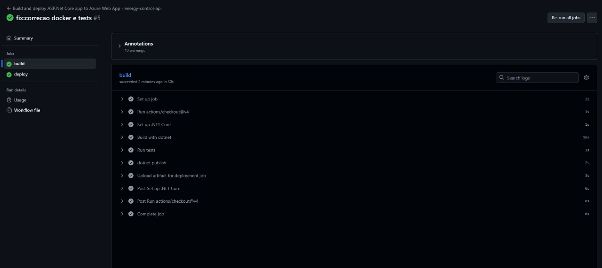
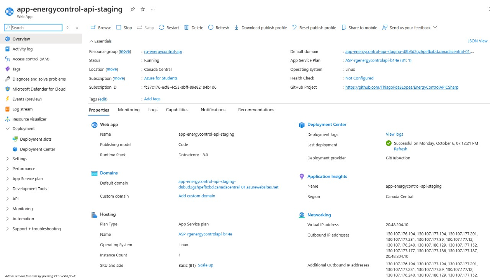
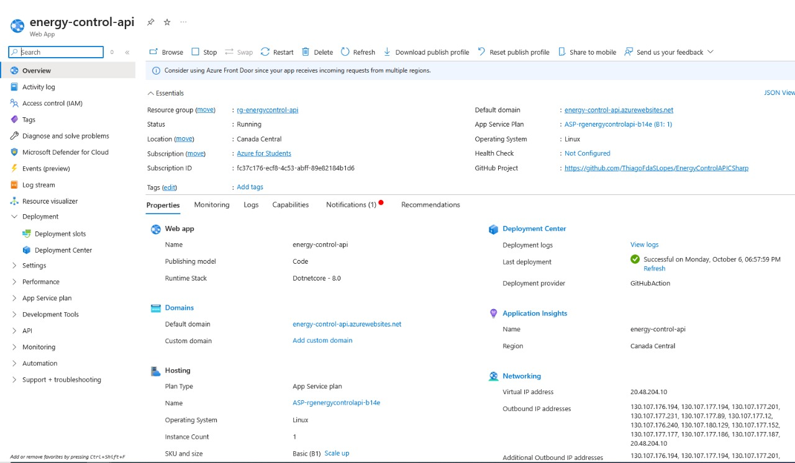

# Projeto - Cidades ESGInteligentes

Este projeto é uma aplicação de API desenvolvida em .NET 8 com o tema de Cidades Inteligentes e ESG. O objetivo principal deste desafio é aplicar um ciclo de vida DevOps completo, incluindo containerização com Docker, orquestração com Docker Compose e um pipeline de Integração e Entrega Contínua (CI/CD) com GitHub Actions para deploy na Azure.

---

## 🚀 Como executar localmente com Docker

Siga os passos abaixo para executar a aplicação e o banco de dados em seu ambiente local.

### Pré-requisitos

Antes de começar, garanta que você tenha as seguintes ferramentas instaladas:

- [Git](https://git-scm.com/)
- [Docker](https://www.docker.com/products/docker-desktop/)
- [Docker Compose](https://docs.docker.com/compose/install/)

### Passos para Execução

1.  **Clone o repositório:**

    ```bash
    git clone https://github.com/ThiagoFdaSLopes/EnergyControlAPICSharp.git
    cd EnergyControlAPICSharp
    ```

2.  **Configure as variáveis de ambiente:**
    O projeto utiliza um arquivo `.env` para gerenciar as configurações sensíveis. Crie um arquivo chamado `.env` na pasta `EnergyControlAPI`, copiando o exemplo `.env-example`.

    ```bash
    cp EnergyControlAPI/.env-example EnergyControlAPI/.env
    ```

    Agora, **edite o arquivo `.env`** com suas próprias chaves e senhas:

    ```env
    # .env
    DB_PASSWORD=sua_senha_forte_para_o_banco
    JWT_KEY=sua_chave_secreta_super_longa_para_jwt
    JWT_ISSUER=SeuEmissor
    JWT_AUDIENCE=SuaAudiencia
    ```

3.  **Inicie os contêineres:**
    Use o Docker Compose para construir as imagens e iniciar os contêineres em modo "detached" (background).

    ```bash
    docker-compose up --build -d
    ```

4.  **Acesse a aplicação:**
    Após alguns instantes, a API estará disponível. Você pode acessar a documentação do Swagger para testar os endpoints:

    - **URL:** `http://localhost:8080/swagger`

5.  **Pare os contêineres:**
    Para parar e remover os contêineres, redes e volumes, execute:
    ```bash
    docker-compose down
    ```

---

## Pipeline CI/CD

A automação de CI/CD para este projeto foi implementada utilizando **GitHub Actions**.

- **Arquivo do Workflow:** `.github/workflows/main.yml`
- **Gatilho (Trigger):** O pipeline é acionado automaticamente em cada `push` realizado na branch `main`.

### Etapas do Pipeline

O pipeline executa os seguintes passos de forma automatizada:

1.  **Build & Test:** Compila a aplicação .NET e executa os testes unitários para garantir a integridade do código.
2.  **Login no Registro:** Autentica no registro de contêineres (ex: Docker Hub ou GitHub Packages).
3.  **Build & Push da Imagem Docker:** Constrói a imagem Docker da aplicação usando a estratégia Multi-Stage e a envia para o registro.
4.  **Deploy em Staging:** Realiza o deploy da nova imagem no ambiente de Staging na Azure Web Apps para validação.
5.  **Deploy em Produção:** Após o sucesso em Staging, realiza o deploy da mesma imagem no ambiente de Produção.

---

## 🐳 Containerização

A aplicação é totalmente containerizada com o Docker para garantir consistência entre os ambientes de desenvolvimento, teste e produção.

### Dockerfile

Utilizamos uma **estratégia Multi-Stage** para criar uma imagem Docker otimizada, que é ao mesmo tempo leve e segura. Isso é feito separando o ambiente de compilação (que usa o SDK completo do .NET) do ambiente de execução final (que usa apenas o ASP.NET Runtime).

```dockerfile
# See https://aka.ms/customizecontainer to learn how to customize your debug container and how Visual Studio uses this Dockerfile to build your images for faster debugging.

# This stage is used when running from VS in fast mode (Default for Debug configuration)

FROM mcr.microsoft.com/dotnet/aspnet:8.0 AS base

USER $APP_UID
WORKDIR /app
EXPOSE 8080
EXPOSE 8081

# This stage is used to build the service project

FROM mcr.microsoft.com/dotnet/sdk:8.0 AS build
ARG BUILD_CONFIGURATION=Release
WORKDIR /src
COPY ["EnergyControlAPI/EnergyControlAPI.csproj", "EnergyControlAPI/"]
RUN dotnet restore "./EnergyControlAPI/EnergyControlAPI.csproj"
COPY . .
WORKDIR "/src/EnergyControlAPI"
RUN dotnet build "./EnergyControlAPI.csproj" -c $BUILD_CONFIGURATION -o /app/build

# This stage is used to publish the service project to be copied to the final stage

FROM build AS publish
ARG BUILD_CONFIGURATION=Release
RUN dotnet publish "./EnergyControlAPI.csproj" -c $BUILD_CONFIGURATION -o /app/publish /p:UseAppHost=false

# This stage is used in production or when running from VS in regular mode (Default when not using the Debug configuration)

FROM base AS final
WORKDIR /app
COPY --from=publish /app/publish .
ENTRYPOINT ["dotnet", "EnergyControlAPI.dll"]
```

### Docker Compose

O `docker-compose.yml` orquestra os serviços da aplicação (`api`) e do banco de dados (`db`), gerenciando a rede para comunicação interna, volumes para persistência de dados e a injeção de variáveis de ambiente.

---

## Prints do Funcionamento

### Pipeline em Execução no GitHub Actions



### Ambiente de Staging

- **URL:** `http://app-energycontrol-api-staging-d8b3d2gzhpefbxbd.canadacentral-01.azurewebsites.net/`



### Ambiente de Produção

- **URL:** `https://energy-control-api.azurewebsites.net`



---

## Tecnologias Utilizadas

- **Backend:** .NET 8, ASP.NET Core
- **Banco de Dados:** SQLite
- **DevOps:** Docker, Docker Compose, GitHub Actions
- **Cloud:** Azure Web Apps

---

## ✅ Checklist de Entrega

| Item                                                | OK    |
| --------------------------------------------------- | ----- |
| Projeto compactado em .ZIP com estrutura organizada | `[x]` |
| Dockerfile funcional                                | `[x]` |
| docker-compose.yml ou arquivos Kubernetes           | `[x]` |
| Pipeline com etapas de build, teste e deploy        | `[x]` |
| README.md com instruções e prints                   | `[x]` |
| Documentação técnica com evidências (PDF ou PPT)    | `[x]` |
| Deploy realizado nos ambientes staging e produção   | `[x]` |
